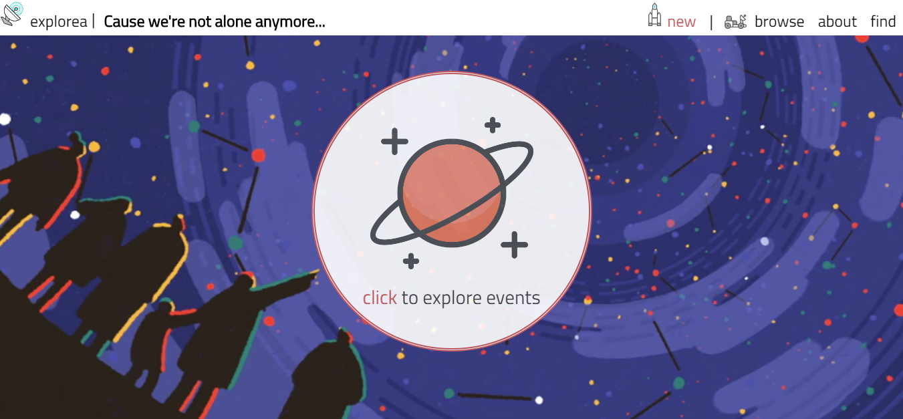

# explorea-event-manager
The aliens have finaly showed themselves up and it's seems they would like to share some knowledge, their planet and even some tea time with us. The Earthers turned up to be very keen on getting to know them to so web apps like Explorea would likely help both sides to keep in touch and organize.

Explorea is an imaginary event managing app based on React, ES6 and Styled Components. Flexbox provides basic responsivenes. 

The project is currently in the middle of developement phase but an overall idea is easliy noticable. 

Explorea covers:

<ul>
    <li>custom event adding (click 'new' in nav bar, basic form validation included)</li>
    <li>event edit/remove
        <ol>
            <li>Buttons appear on event hover</li>
            <li>Click on category icon to change it (text will be added to each icon)</li>
            <li>Edit event contents at will then click confirm</li>
        </ol></li>
    <li>category search 
        <ol>
            <li>Choose browse in the navbar</li>
            <li>Click on the planet to display categories</li>
            <li>Choose your category</li>
        </ol>
    </li>
    <li>filter by event name
        <ol>
            <li>In the navbar choose explorea/browse</li>
            <li>Click on the planet to activate input field</li>
            <li>Type event name</li>
            <li>Click 'search' or press Enter </li>
        </ol>
    </li>
    <li>Google Places Autocomplete API</li>
    <li>date picker</li>
    <li>basic responsivenes</li>
</ul>

<h2>Folder Structure</h2>

 After cloning the folder structure should look like this:
<pre>
    <code>
        'explorea-event-manager/
            icons/
            images/
            js/
                components/
                    styled-components/
                        about-style.jsx
                        category-buttons-style.jsx
                        event-style.jsx
                        footer-style.jsx
                        nav-style.jsx
                        new-event-style.jsx
                        planet-style.jsx
                        keyframes.js
                        media.js
                        theme.js
                    about.jsx
                    blank-event.jsx
                    category-button.jsx
                    datepicker.jsx
                    erroboundary.jsx
                    event-button.jsx
                    event.jsx
                    events.jsx
                    footer.jsx
                    form.jsx
                    nav.jsx
                    new-event.jsx
                    placesAPI.jsx
                    planet-button.jsx
                    planet.jsx
                    typer.jsx
                app.jsx
            scss/
                daypicker.scss
                main.scss
            index.html
            package.json
            README.md
            screenshot.PNG
            webpack.config.js
        '
    </code>
</pre>

 Note that at the moment nearly all project is styled via Styled Components that are stored in js/components/styled-components/ . Nevertheless, a pre-made daypicker component remains still styled via traditional scss notation, that you will find in scss/ folder. 

<h2>Available Scripts</h2>

In the project directory, you can run:

<h4><code>npm start</code></h4>

Runs the app in the development mode.
Open http://localhost:8080 to view it in the browser.

The page will reload if you make edits.
You will also see any lint errors in the console.

<h4><code>npm run build</code></h4>

Builds the app for production to the build folder.
It correctly bundles React in production mode and optimizes the build for the best performance. 

<h2>Importing a component</h2>

This project setup supports ES6 modules thanks to Babel and uses <code> import </code> and <code> export </code>
instead of <code> require() </code> and <code>module.exports</code>.
